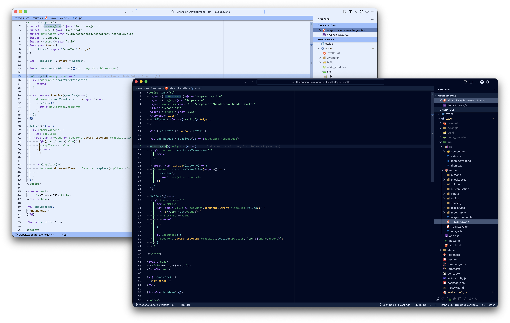
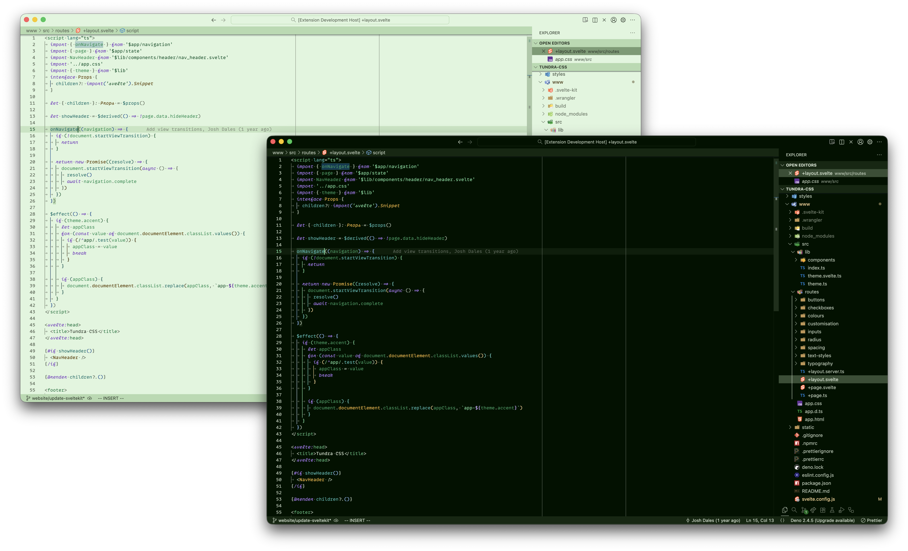

# Taiga Theme

Light and dark themes for editors, pairs nicely with a font like [MonoLisa](https://www.monolisa.dev/) that has a distinct italic variant.

Currently supported editors and terminals:
- Ghostty
- VS Code
- Warp
- Zed

---

Logo courtesy of [Hana Kim](http://nameishana.com)
